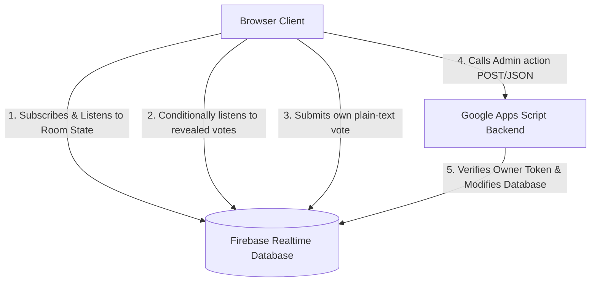

# Project Context & AI Guidance: Planning Poker App

This document serves as a persistent context guide and blueprint for the **Real-Time Planning Poker Web Application** codebase. It outlines the project overview, system architecture, codebase mapping, security model, coding standards, and critical constraints to guide AI agents and human developers in maintaining and expanding the application.

---

## 1. Project Overview & Architecture

The Planning Poker App is a real-time estimation tool for Agile teams. It leverages a decentralized, serverless architecture that operates without a traditional self-hosted backend.

### Technical Stack
*   **Frontend Hosting:** GitHub Pages (static site hosting)
*   **Real-Time Data Sync:** Firebase Realtime Database (RTDB)
*   **Authentication:** Firebase Anonymous Authentication
*   **Secure Administration Backend:** Google Apps Script Web App (GAS)
*   **Local Backend Management:** CLASP (Command Line Apps Script Projects)
*   **UI/Styling:** Vanilla CSS (modern layout, CSS variables, flexbox, grid, glassmorphism, and keyframe animations)

### System Data Flow

The architecture prevents frontends from making unauthorized database mutations or viewing hidden estimates before cards are revealed.



---

## 2. Codebase Directory Map

*   **[index.html](file:///Users/vitaliimarchenko/workplace/planning-poker-app/index.html):** The entry point containing the landing screen (Create/Join rooms), the main estimation room interface, dialog modals, stats panels, and DOM skeletons.
*   **[style.css](file:///Users/vitaliimarchenko/workplace/planning-poker-app/style.css):** Design system definition containing CSS variables (`--bg`, `--surface`, `--accent`, `--primary-light`, etc.), glassmorphism utility classes, grid systems, responsive media queries, and card-flip/hover animations.
*   **[app.js](file:///Users/vitaliimarchenko/workplace/planning-poker-app/app.js):** The primary frontend logic file. Uses Firebase v10 web SDK modular syntax (`initializeApp`, `getDatabase`, `ref`, `onValue`, `onDisconnect`, `signInAnonymously`). Handles presence updates, room/votes state synchronization, card selection rendering, and stats calculation.
*   **[config.js](file:///Users/vitaliimarchenko/workplace/planning-poker-app/config.js):** Houses environment configurations exported as the `CONFIG` object, containing `CONFIG.FIREBASE` (Firebase credentials) and `CONFIG.APPS_SCRIPT_URL` (the deployed GAS endpoint).
*   **[Code.gs](file:///Users/vitaliimarchenko/workplace/planning-poker-app/Code.gs):** Google Apps Script server-side JavaScript code. Exposes `doGet`/`doPost` endpoints acting as REST routes. Handles room initialization, owner validation, ticket name changes, card deck switches, and card-revealing actions.
*   **[database-rules.json](file:///Users/vitaliimarchenko/workplace/planning-poker-app/database-rules.json):** Security rules for the Firebase RTDB, defining read/write permissions for rooms, votes, and ownership tokens.
*   **[appsscript.json](file:///Users/vitaliimarchenko/workplace/planning-poker-app/appsscript.json):** Project settings manifest for Google Apps Script deployment (defines runtime version V8, timeZone, and webapp permissions).
*   **[.clasp.json](file:///Users/vitaliimarchenko/workplace/planning-poker-app/.clasp.json):** Configuration mapping local backend code to the remote Google Apps Script container.
*   **[.claspignore](file:///Users/vitaliimarchenko/workplace/planning-poker-app/.claspignore):** Lists local files that should not be pushed to Google Apps Script (e.g., node modules, frontend assets, configs).
*   **[package.json](file:///Users/vitaliimarchenko/workplace/planning-poker-app/package.json) / node_modules:** Declares the `firebase` npm dependency. These exist for local tooling and IDE autocompletion only — the frontend imports Firebase modules directly from the CDN (`gstatic.com`), not from `node_modules`.
*   **[README.md](file:///Users/vitaliimarchenko/workplace/planning-poker-app/README.md):** Project documentation and usage instructions.

---

## 3. Core Database & State Schema

### Realtime Database Schema

```json
{
  "rooms": {
    "<roomId>": {
      "ticket": "string",
      "revealed": "boolean",
      "deckType": "string (enum: 'fibonacci' | 'days')",
      "lastActive": "number (timestamp)",
      "users": {
        "<userId>": {
          "name": "string",
          "hasVoted": "boolean"
        }
      }
    }
  },
  "votes": {
    "<roomId>": {
      "<userId>": "string"
    }
  },
  "owners": {
    "<roomId>": {
      "ownerToken": "string"
    }
  }
}
```

### Client-Side State (localStorage)

The browser stores the following keys in `localStorage` for session persistence. These are **the only form of state persistence** on the client — there is no server-side session.

| Key                        | Purpose                                  | Scope     |
|----------------------------|------------------------------------------|-----------|
| `userName`                 | Persists the user's display name         | Global    |
| `ownerToken_${roomId}`     | Stores the room ownership token          | Per-room  |
| `vote_${roomId}`           | Caches the user's selected card value    | Per-room  |

> **⚠️ Important:** If `ownerToken_${roomId}` is cleared (e.g., browser data wipe), room ownership is permanently lost. There is no recovery mechanism.

### Deck Templates

Card values for each deck type are defined in `DECK_TEMPLATES` in [app.js](file:///Users/vitaliimarchenko/workplace/planning-poker-app/app.js):
*   **fibonacci:** `['0', '1', '2', '3', '5', '8', '13', '21', '34', '55', '89', '?', '☕']`
*   **days:** `['0.5', '1', '1.5', '2', '2.5', '3', '3.5', '4', '4.5', '5', '5.5', '6', '6.5', '7', '?', '☕']`

Both decks include `?` (unsure) and `☕` (need a break) as non-numeric special cards. When adding a new deck type, follow this same pattern.

---

## 4. Key Security & Operations Logic

### 1. Vote Hiding Mechanism
To prevent cheating, voters must not be able to read other voters' cards before they are revealed.
*   **Rule Configuration:** In [database-rules.json](file:///Users/vitaliimarchenko/workplace/planning-poker-app/database-rules.json), `.read` access under `votes/$roomId` is restricted:
    `"root.child('rooms').child($roomId).child('revealed').val() === true"`
*   **Frontend Subscription:** In [app.js](file:///Users/vitaliimarchenko/workplace/planning-poker-app/app.js), the listener `syncVotesListener()` subscribes to `votes/$roomId` **only** if `roomData.revealed` is true. If false, it unsubscribes immediately (`off(votesRef)`) to avoid triggering Firebase "Permission Denied" console errors.

### 2. Vote Write-Lock After Reveal
Users must not be able to change or submit votes after cards are revealed.
*   **Rule Configuration:** In [database-rules.json](file:///Users/vitaliimarchenko/workplace/planning-poker-app/database-rules.json), `.write` access under `votes/$roomId/$userId` requires:
    `"auth != null && auth.uid === $userId && root.child('rooms').child($roomId).child('revealed').val() !== true"`
    This ensures only the authenticated user can write to their own vote slot, **and only while cards are not revealed**.
*   **Frontend Guard:** In [app.js](file:///Users/vitaliimarchenko/workplace/planning-poker-app/app.js), `submitVote()` has an early return: `if (roomData.revealed) return;`

### 3. Vote Toggle Behavior
Clicking a card submits a vote. Clicking the **same card again** removes the vote (toggles it off). This is implemented in `submitVote()` in [app.js](file:///Users/vitaliimarchenko/workplace/planning-poker-app/app.js) by comparing the selected value against `localStorage.getItem('vote_${roomId}')`.

### 4. Apps Script Actions & CORS Preflight Bypass
Google Apps Script Web Apps do not support CORS preflight (`OPTIONS` requests). 
*   **Workaround:** The frontend `callBackend()` executes `fetch()` with `headers: { 'Content-Type': 'text/plain' }` using a JSON string in the body. Using `text/plain` triggers simple request classification in browsers, bypassing CORS preflights while still carrying the JSON payload.
*   **Execution Flow:** Apps Script reads and parses the JSON body in `doPost()` to process action requests.

### 5. Presence Handling
If a client closes their tab or disconnects, they should be removed from the room list automatically.
*   **Mechanism:** Under `setupUserPresence()` in [app.js](file:///Users/vitaliimarchenko/workplace/planning-poker-app/app.js), `onDisconnect().remove()` is registered on the path `rooms/$roomId/users/$userId` to clean up the presence list immediately.

### 6. Smart Database Cleanup (Purging Storage)
To keep the Firebase storage size near zero and run the application free forever, a scheduled cleanup script is utilized.
*   **Mechanism:** Inside [Code.gs](file:///Users/vitaliimarchenko/workplace/planning-poker-app/Code.gs), `smartDatabaseCleanup()` scans all rooms. If a room has zero online users (`rooms/$roomId/users` is empty) and its `lastActive` timestamp (updated on room creation/voting resets/reveals) is older than 24 hours, the room, its owner token, and its votes are deleted.
*   **Trigger Setup:** Triggered periodically (e.g. every 12 or 24 hours) via Google Apps Script's native Time-driven triggers.

### 7. Room ID Generation
Room IDs are 6-character codes generated in `generateRoomId()` in [Code.gs](file:///Users/vitaliimarchenko/workplace/planning-poker-app/Code.gs) using a curated character set: `ABCDEFGHJKLMNPQRSTUVWXYZ23456789`. The letters `O`, `I` and digits `0`, `1` are deliberately excluded to prevent visual confusion when sharing room codes verbally or via screenshots.

---

## 5. Available Backend Actions

All admin actions are routed through `callBackend()` in [app.js](file:///Users/vitaliimarchenko/workplace/planning-poker-app/app.js) to `doPost()` in [Code.gs](file:///Users/vitaliimarchenko/workplace/planning-poker-app/Code.gs).

| Action           | Owner Only | Side Effects                                                                 |
|------------------|-----------|-------------------------------------------------------------------------------|
| `createRoom`     | N/A       | Creates room, owner token, returns `roomId` and `ownerToken`                  |
| `updateTicket`   | ✅        | Sets ticket name, resets `revealed` to false, clears all votes and `hasVoted` flags |
| `changeDeckType` | ✅        | Sets deck type, resets `revealed` to false, clears all votes and `hasVoted` flags |
| `revealCards`    | ✅        | Sets `revealed: true`, updates `lastActive` timestamp                         |

> **Note:** There is no separate "reset round" action. The **"Reset Room" button** in the UI calls `updateTicket` with the current ticket value, which resets `revealed`, clears all votes, and resets `hasVoted` flags — effectively starting a new voting round.

---

## 6. Development & Deployment Procedures

### Pushing Script Code
Use Clasp to compile and upload `Code.gs` and `appsscript.json`:
```bash
# Login to clasp
clasp login

# Push local changes to the Google Apps Script project
clasp push
```

### Config & Database Secret Verification
Ensure you provide the correct properties in Google Apps Script -> Project Settings -> Script Properties:
*   `FIREBASE_DB_URL`: Firebase database base URL (e.g. `https://[project-id]-default-rtdb.europe-west1.firebasedatabase.app`)
*   `FIREBASE_DB_SECRET`: Database secret or service account credentials allowing REST read/write bypass for GAS.

---

## 7. Coding & AI Guidelines

When editing this codebase, maintain compliance with the following rules:

*   **Design Quality:** The UI uses a dark mode aesthetic with glassmorphism panels. When creating or updating components, use standard CSS variable tokens in `style.css` rather than ad-hoc styling. Ensure layouts remain responsive and optimized for mobile viewports.
*   **CORS Warning:** Do not change the `Content-Type` header of frontend API calls to Apps Script to `application/json`, as this will restore CORS preflight checks and break communication. Keep it as `text/plain`.
*   **Clean Database Operations:**
    *   Do not attempt to write directly to room settings (`ticket`, `revealed`, `deckType`) from the client; always route these modifications through `callBackend()`.
    *   Only write user names and voting checkboxes directly from the frontend to `rooms/$roomId/users/$userId`.
*   **Modular Firebase Calls:** Follow the Firebase modular SDK format imported from `https://www.gstatic.com/firebasejs/10.8.0/`. Do not switch to the legacy compat library or older v8/v9 syntax unless requested.

---

## 8. Known Gotchas & Pitfalls

*   **Owner token loss:** Clearing `localStorage` loses room ownership permanently. There is no recovery mechanism — the `ownerToken` is generated once on room creation and stored only client-side.
*   **`updateTicket` is the reset:** There is no separate "reset round" backend action. The "Reset Room" button calls `updateTicket` with the current ticket value, which clears all votes and resets the revealed state.
*   **Vote write locking:** Users cannot write to `votes/` after cards are revealed. This is enforced both by database rules and by the frontend's `submitVote()` guard. Do not remove either check.
*   **Do not add `mode: 'no-cors'`:** The `fetch()` calls in `callBackend()` must not include `mode: 'no-cors'`, as that would prevent reading the response. The CORS bypass is achieved via the `text/plain` Content-Type header alone.
*   **`changeDeckType` clears votes:** Switching deck types is a destructive action that resets the current voting round entirely (same side effects as `updateTicket`).
